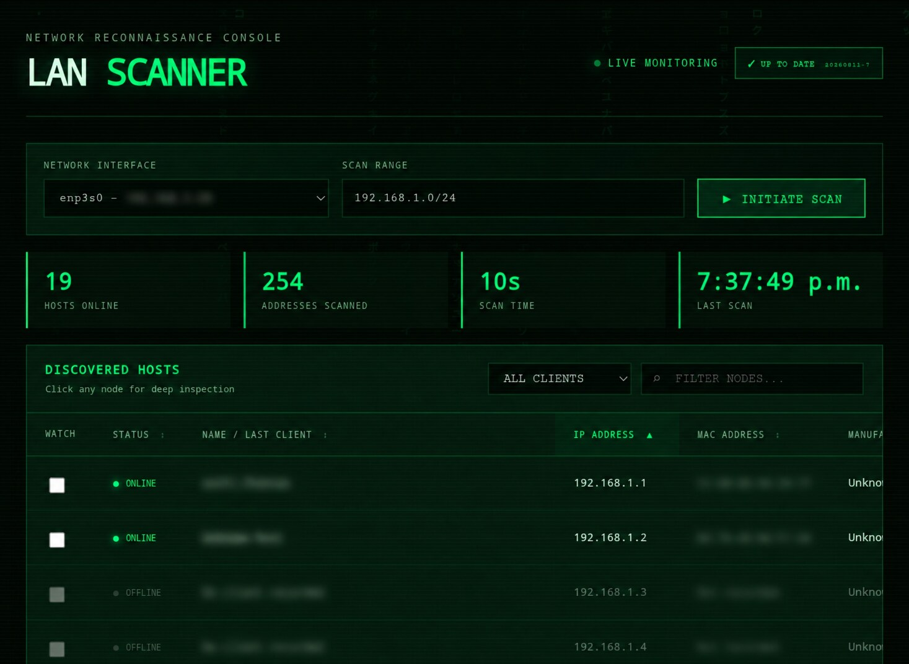

# LAN Scanner

A Linux web application for authorized local-network discovery. It lists online hosts with hostname, IPv4, MAC address and manufacturer, and opens a detailed top-1000 TCP port/service scan for each host.



The full subnet stays visible: offline addresses are dimmed and retain the last hostname, MAC address, manufacturer, and last-seen time. While the page is open, a lightweight presence scan runs about every 15 seconds for a /24 network. Larger ranges automatically use 30- or 60-second intervals, and monitoring stops when no browser is watching. A known online client must fail three consecutive checks before it is marked offline, preventing transient packet loss or Wi-Fi power saving from making solid clients flicker.

The device table can be sorted by status, last-known name, IP address, MAC address, or manufacturer. Its status filter can show all clients, online clients only, or offline addresses only.

## Android app (preview)

The repository also contains a fully native, stand-alone Android scanner in [`android/`](android/). It does not connect to the Linux service or require a router/controller integration. The interface retains the same dark phosphor-green console appearance and includes:

- automatic local-subnet detection plus an editable `/24` to `/30` CIDR;
- verified IPv4/MAC pairs, offline history, local IEEE vendor lookup, hostname and latency;
- sorting, all/online/offline status filters, TCP port inspection and user-initiated full scans;
- up to 16 immediate-watch targets pinged once per second, with grouped result cells that clear and restart after filling the row.
- inertial touch scrolling, animated code rain matching the Linux interface, three-state status filtering and a built-in About/source panel;
- a radar/router adaptive launcher icon, the bundled open-source Share Tech Mono typeface and phosphor glow effects matching the Linux interface.

After a full scan, every usable address in the selected subnet is listed. Addresses without an active neighbor are dimmed as offline; if one was seen previously, its last-known MAC, vendor and hostname are retained. To keep a `/24` list smooth, Android lays out the complete result set but only renders the cards currently visible on screen.

MAC address visibility is a hard requirement for this build. Android removed access to the kernel ARP table for newer target SDKs, so this sideload edition deliberately targets Android API 31 while compiling with current tooling. It reads `/proc/net/arp`; if a phone vendor blocks that file anyway, the app reports `MAC ACCESS REQUIRED` and refuses to present misleading partial results. It cannot discover MAC addresses across a routed VLAN.

On devices that block `/proc/net/arp` (including recent Samsung firmware), the app falls back to a native read-only netlink neighbor-table dump and then to `SIOCGARP`. Automatic range detection accepts only RFC1918 addresses on Wi-Fi or Ethernet; cellular, CGNAT, VPN and Tailscale interfaces are never selected for a LAN scan.

Every Android change is compiled by GitHub Actions. Open the latest `Android APK` workflow run, download the `lan-scanner-android` artifact and sideload `app-debug.apk`. GitHub release builds also attach it as `lan-scanner-android.apk`. Google Play distribution is intentionally not supported because raising the target SDK would remove the required ARP/MAC behavior.

**Permanent public download:** [Download the latest Android APK](https://github.com/flotron/lan-scanner/releases/latest/download/lan-scanner-android.apk). No GitHub account is required. Versioned APKs remain available on the [Releases page](https://github.com/flotron/lan-scanner/releases).

## Immediate watch

Select the `WATCH` checkbox beside the few addresses you are working on. They are grouped in one panel and pinged concurrently once per second, independently from normal network discovery. Every target shows its immediate state, latency, check time, and the last 18 replies. A single missed reply is shown immediately in this panel; the conservative three-check rule continues to apply only to the general device list. Selections are kept in the browser and the endpoint is capped at 32 addresses to prevent accidental load.

Host identification tries reverse DNS, mDNS/Bonjour, NetBIOS, and SNMP. SNMP uses the read-only `public` community by default and is especially useful for printers; it can be changed with the `LANSCAN_SNMP_COMMUNITY` environment variable. Unknown online hosts are retried at most once per hour, so enhanced identification does not burden continuous presence monitoring.

## Install

```bash
chmod +x install.sh uninstall.sh
sudo ./install.sh
```

The installer checks TCP ports starting at `8765`, chooses the first free one, installs a hardened systemd service, starts it, and prints the final URL. To start searching at another port:

```bash
sudo LANSCAN_START_PORT=8080 ./install.sh
```

Supported package managers are APT, DNF and Pacman. The installer automatically provides Python 3, Nmap, iproute2, ping utilities, curl, tar and systemd tools. It also installs Avahi and NetBIOS lookup tools when available for better host identification. Vendor lookup uses Nmap's local MAC-prefix database, so it works without sending device data to an external service.

The installer skips package-manager updates when all requirements are already installed. A broken unrelated APT repository therefore cannot block an otherwise ready system.

## Notes

- The default range is taken from the first active, globally addressed network interface.
- A different CIDR may be entered; discovery is capped at 4096 addresses (/20) to prevent accidental oversized scans.
- MAC addresses are normally available only for devices on the same Layer-2 network/VLAN.
- OS detection and some service details depend on device response and scanner privileges.
- Scan only networks you own or are authorized to inspect.

## Service controls

```bash
sudo systemctl status lan-scanner
sudo systemctl restart lan-scanner
sudo journalctl -u lan-scanner -f
```

## Install or update from GitHub

After the public repository is available, a new machine can install the current version with:

```bash
curl -fsSL https://raw.githubusercontent.com/flotron/lan-scanner/main/install-online.sh | sudo bash
```

An installed machine updates from the same repository with:

```bash
sudo /opt/lan-scanner/update.sh
```

You can also use the `UPDATE` button in the web interface without opening a terminal. Web updates are accepted only from the local network and always download from this fixed repository. The updater validates the download before touching the running installation, preserves the configured port and performs an automatic rollback if the new service does not become healthy. Device history in `/var/lib/lan-scanner` is preserved.

The installer selects a free port only on the first installation. Reinstalling or updating reuses the port stored in `/var/lib/lan-scanner/port`; it chooses another port only during recovery when the saved port is genuinely occupied by a different process.

Required dependencies are installed automatically: Python 3, Nmap, `iproute2`, ping utilities, curl, tar and systemd tools. Avahi and NetBIOS lookup tools are also installed when available to improve host-name identification. The supported package managers are APT, DNF and Pacman; an unrelated broken APT repository produces a warning and the installer still tries the available package indexes.
